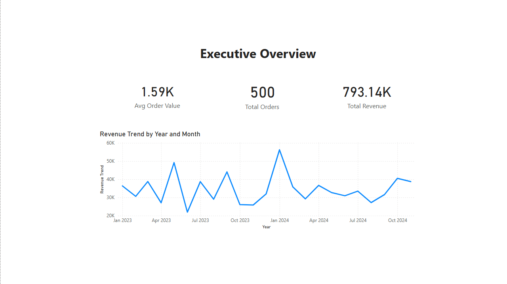
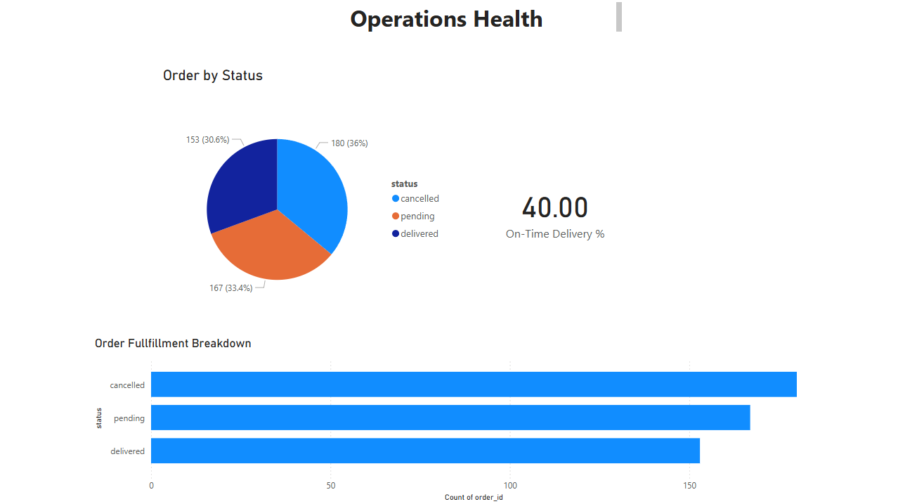
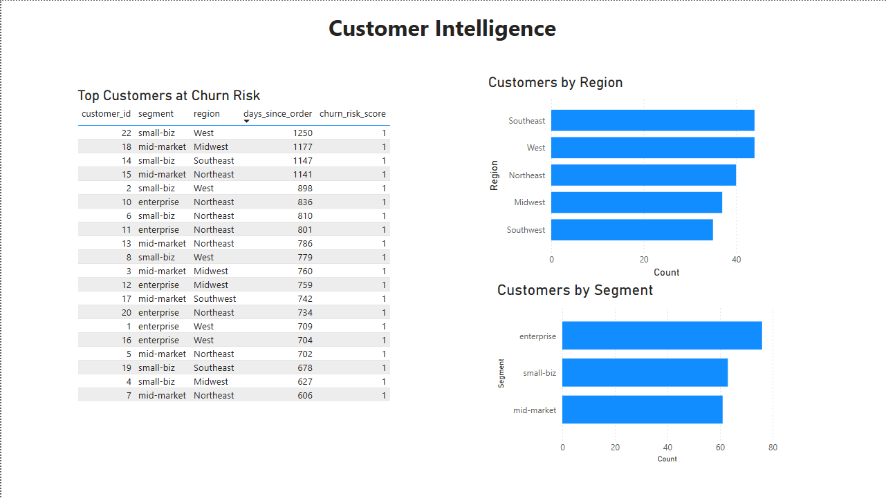
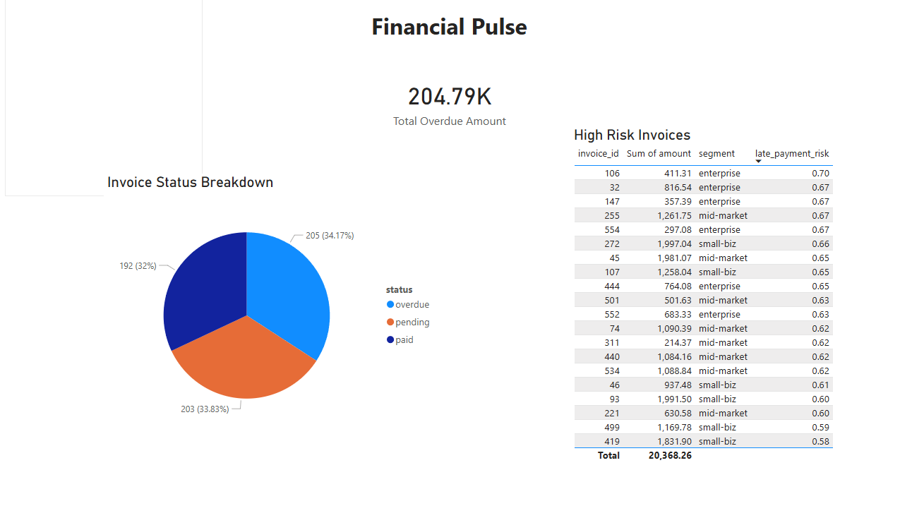
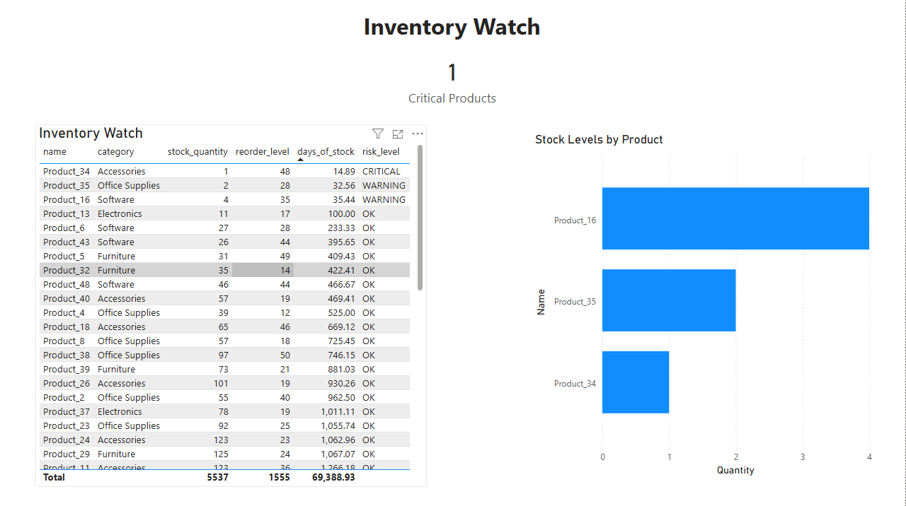

# SmartBiz Analytics Platform

> An end-to-end business intelligence platform built from scratch to simulate how real companies use ERP data for decision-making. SQL · Python · Power BI

---

## The Problem

ERP systems like Odoo are excellent at running day-to-day operations — orders, invoices, inventory, support — but they don't always surface the insights leadership actually needs. During my Business Systems Analyst internship at Odoo, I saw this gap firsthand: companies had all the data, but no analytical layer turning it into decisions.

This project is my attempt to build that missing layer.

---

## What's Inside

**1. SQL Database**
A 6-table relational schema modeling a realistic mid-size business:
- `customers` — 200 simulated companies across 5 regions and 3 segments
- `products` — 50 products across 5 categories
- `orders` and `order_items` — 500 orders with realistic delivery timelines (including early and late deliveries)
- `invoices` — 600 invoices with payment status logic (paid, pending, overdue)
- `support_tickets` — 300 tickets with category, priority, and resolution tracking

15 business analysis queries answering real operational questions: revenue trends, on-time delivery rates, overdue invoices by segment, top products, customer lifetime value, payment lag, churn signals, and more.

**2. Python Data Generation & Modeling**
All data is generated programmatically using Python (`random`, `datetime`) to create realistic, internally consistent relationships across tables — invoice due dates that logically follow issue dates, delivery dates that sometimes run early and sometimes late, and order totals calculated from actual line items.

Predictive models built with Pandas and scikit-learn:
- Customer churn risk model (RandomForest classifier) — scores all 200 customers by churn probability
- Late invoice payment predictor (RandomForest classifier) — 89.2% accuracy, flags high risk invoices
- Inventory stockout alert system — calculates days of stock remaining based on sales velocity

**3. Power BI Dashboard**
A 5-page executive dashboard:
- Executive Overview — total revenue ($793K), order volume, monthly revenue trend
- Operations Health — on-time delivery rate (40%), order fulfillment breakdown
- Customer Intelligence — churn risk table, customers by segment and region
- Financial Pulse — $204K overdue, invoice status breakdown, high risk invoice table
- Inventory Watch — critical stockout alerts, stock levels by product

---

## Dashboard Screenshots

### Page 1 — Executive Overview

### Page 2 — Operations Health

### Page 3 — Customer Intelligence

### Page 4 — Financial Pulse

### Page 5 — Inventory Watch

---

## Tech Stack

Python · Pandas · scikit-learn · SQLite · Power BI · Git/GitHub

---

## Status

**Phase 1 — Complete ✅**
- 6-table relational database designed and built in SQLite
- 2,643 records generated across all tables using Python
- Full data generation script (generate_data.py) with realistic conditional logic

**Phase 2 — Complete ✅**
- 15 SQL business analysis queries
- 3 Python predictive models (churn, late payments, stockout alerts)
- 5-page Power BI executive dashboard

---

## How to Run

1. Clone this repo
2. Run `python python/generate_data.py` to generate all datasets
3. Open `sql/smartbiz.db` in DB Browser for SQLite to explore the database
4. Run queries from `sql/business_queries.sql`
5. Run `python python/analysis.py` to generate all model outputs
6. Open `dashboard/smartbiz_dashboard.pbix` in Power BI Desktop to view the dashboard

---

## Key Findings

- **$793K total revenue** generated across 500 orders (Jan 2023 — Dec 2024)
- **40% on-time delivery rate** — majority of orders arrive late, flagged for operations review
- **$204K in overdue invoices** — 34% of all invoices unpaid past due date
- **185 of 200 customers** flagged as churn risk based on 180+ days since last order
- **1 critical stockout** — Product_34 (Accessories) has only 14.9 days of stock remaining
- **Feature importance** revealed behavioral signals (recency, frequency, spend) drive churn prediction — not demographic factors like segment or region

---

*Built by Rishit Garg | [LinkedIn](https://www.linkedin.com/in/garg-rishit) | [GitHub](https://github.com/rishitgargcode)*